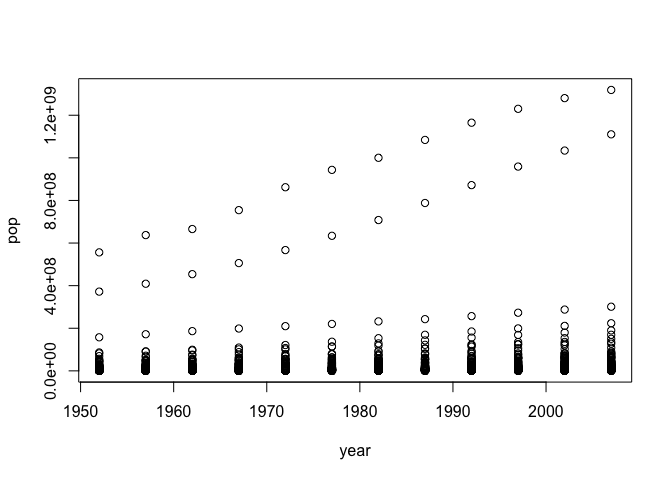

```r
install.packages("gapminder", repos = "http://cran.us.r-project.org")
```

```
## 
## The downloaded binary packages are in
## 	/var/folders/wy/3tt432252bn_p3gv063hkn1r0000gn/T//Rtmpu5FbwT/downloaded_packages
```


```r
library(gapminder)
str(gapminder)
```

```
## Classes 'tbl_df', 'tbl' and 'data.frame':	1704 obs. of  6 variables:
##  $ country  : Factor w/ 142 levels "Afghanistan",..: 1 1 1 1 1 1 1 1 1 1 ...
##  $ continent: Factor w/ 5 levels "Africa","Americas",..: 3 3 3 3 3 3 3 3 3 3 ...
##  $ year     : int  1952 1957 1962 1967 1972 1977 1982 1987 1992 1997 ...
##  $ lifeExp  : num  28.8 30.3 32 34 36.1 ...
##  $ pop      : int  8425333 9240934 10267083 11537966 13079460 14880372 12881816 13867957 16317921 22227415 ...
##  $ gdpPercap: num  779 821 853 836 740 ...
```


```r
install.packages("tidyverse", repos = "http://cran.us.r-project.org")
```

```
## 
## The downloaded binary packages are in
## 	/var/folders/wy/3tt432252bn_p3gv063hkn1r0000gn/T//Rtmpu5FbwT/downloaded_packages
```

```r
library(tidyverse)
```

```
## ── Attaching packages ───────────────────────────────────────── tidyverse 1.2.1 ──
```

```
## ✔ ggplot2 3.0.0     ✔ purrr   0.2.5
## ✔ tibble  1.4.2     ✔ dplyr   0.7.6
## ✔ tidyr   0.8.1     ✔ stringr 1.3.1
## ✔ readr   1.1.1     ✔ forcats 0.3.0
```

```
## ── Conflicts ──────────────────────────────────────────── tidyverse_conflicts() ──
## ✖ dplyr::filter() masks stats::filter()
## ✖ dplyr::lag()    masks stats::lag()
```


```r
as_tibble(gapminder)
```

```
## # A tibble: 1,704 x 6
##    country     continent  year lifeExp      pop gdpPercap
##    <fct>       <fct>     <int>   <dbl>    <int>     <dbl>
##  1 Afghanistan Asia       1952    28.8  8425333      779.
##  2 Afghanistan Asia       1957    30.3  9240934      821.
##  3 Afghanistan Asia       1962    32.0 10267083      853.
##  4 Afghanistan Asia       1967    34.0 11537966      836.
##  5 Afghanistan Asia       1972    36.1 13079460      740.
##  6 Afghanistan Asia       1977    38.4 14880372      786.
##  7 Afghanistan Asia       1982    39.9 12881816      978.
##  8 Afghanistan Asia       1987    40.8 13867957      852.
##  9 Afghanistan Asia       1992    41.7 16317921      649.
## 10 Afghanistan Asia       1997    41.8 22227415      635.
## # ... with 1,694 more rows
```


```r
plot(pop ~ year, gapminder)
```

<!-- -->

```r
hist(gapminder$gdpPercap)
```

<!-- -->

```r
summary(gapminder$pop)
```

```
##      Min.   1st Qu.    Median      Mean   3rd Qu.      Max. 
## 6.001e+04 2.794e+06 7.024e+06 2.960e+07 1.959e+07 1.319e+09
```


